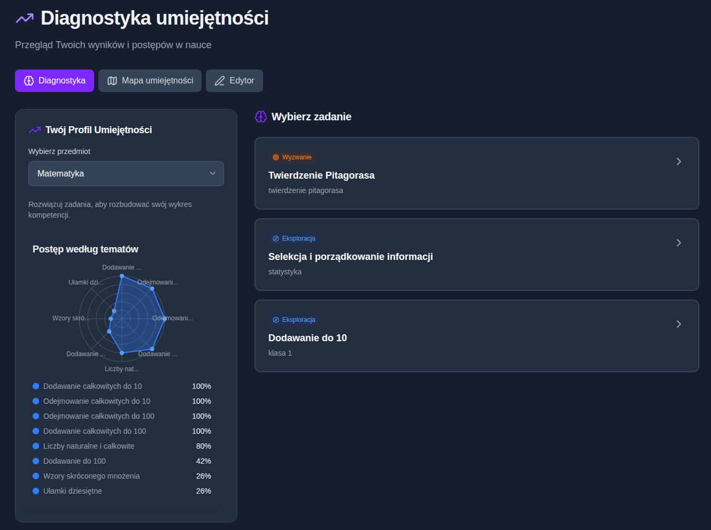

# Hybrid OKF Tutor

> **LLM rozumie pytanie. Wiedza pochodzi z kontrolowanego OKF.**

Hackathonowe demo tutora matematycznego, który interpretuje naturalne pytanie ucznia, ale nie traktuje pamięci modelu językowego jako źródła wiedzy edukacyjnej.

- **Zespół:** BRAVE UnAIted
- **Status:** P0 / hackathon demo
- **Wiedza:** DEV / UNREVIEWED

[](https://youtu.be/Dpf8MdLbPv4)

**[Obejrzyj 55-sekundowe demo na YouTube](https://youtu.be/Dpf8MdLbPv4)**

## Problem

Uczeń przygotowujący się do egzaminu ósmoklasisty korzysta z podręczników, filmów, korepetycji i ogólnych chatbotów AI. Te źródła są rozproszone, nie tworzą jednego obrazu potrzeb ucznia, a odpowiedź ogólnego modelu może nie mieć oparcia w kontrolowanej wiedzy.

Hybrid OKF Tutor rozdziela dwie odpowiedzialności:

- model językowy rozumie, o co uczeń pyta;
- kontrolowany OKF dostarcza fakty edukacyjne;
- deterministyczna warstwa składa odpowiedź albo jawnie zgłasza brak danych.

## Jak działa P0

```text
Pytanie ucznia po polsku
        ↓
LLM Intent Interpreter
        ↓
StructuredIntent
        ↓
OkfRepository
        ↓
kontrolowany odczyt z OKF
        ↓
deterministyczna odpowiedź
```

Zaakceptowany zakres P0 obejmuje:

- interpretację naturalnego języka, parafraz i literówek;
- rozpoznanie intencji oraz kontekstu rozmowy;
- dopytanie zamiast zgadywania przy niejednoznacznym pytaniu;
- pobranie wiedzy przez wąski, read-only kontrakt `searchConcepts()` / `getConcept()`;
- jawny brak odpowiedzi, gdy OKF nie pokrywa pytania;
- widoczny status `DEV/UNREVIEWED` dla wiedzy w stanie draft lub pending;
- reakcję na sygnały frustracji i bezpieczeństwa wykryte w tekście ucznia.

> LLM nie ma wiedzieć matematyki — ma rozumieć, o co uczeń pyta.

## Materiały demo

### Pełne demo

- [Hybrid OKF Tutor — demo 55 s na YouTube](https://youtu.be/Dpf8MdLbPv4)
- [Krótkie nagranie rozwiązania zadania](docs/demo/recordings/2026-08-28-hybrid-tutor-solution-demo.webm) — WebM, 15 s, bez audio

### Diagnostyka umiejętności — kierunek produktu



Powyższy ekran pokazuje **roadmapę produktu**, a nie zakres działającego P0. Diagnoza, mapa luk, dobór ćwiczeń i śledzenie postępów należą do kolejnej fazy.

## P0 a roadmapa

| P0 — rdzeń hackathonowy | Roadmapa produktu |
| --- | --- |
| Naturalne pytanie po polsku | Diagnoza umiejętności |
| Interpretacja intencji przez LLM | Mapa luk ucznia |
| Kontrolowana wiedza z OKF | Priorytetyzowana lista ćwiczeń |
| Dopytanie zamiast zgadywania | Śledzenie postępów |
| Deterministyczna odpowiedź | Adaptacja trudności |
| Sygnały emocjonalne w tekście | Sygnały behawioralne |

Rozdzielenie zakresów jest opisane w [roadmapie P0 i produktu docelowego](context/foundation/roadmap.md).

## Bezpieczeństwo i granice

- LLM interpretuje intencję i kontekst, ale nie jest źródłem faktów matematycznych.
- Przeglądarka nie otrzymuje Supabase `service_role` ani dowolnego dostępu do bazy.
- Publiczne repo nie zawiera kodu prywatnego monorepo, dumpów OKF, danych uczniów ani sekretów.
- Wiedza draft/pending jest dozwolona wyłącznie w kontrolowanym trybie demo i zawsze oznaczona jako `DEV/UNREVIEWED`.
- System nie diagnozuje stanu psychicznego i nie tworzy trwałego profilu emocjonalnego ucznia.
- Sygnał bezpieczeństwa ma pierwszeństwo przed przepływem edukacyjnym.

## Deployment

- **Publiczny adres:** [hybrid-okf-tutor.vercel.app](https://hybrid-okf-tutor.vercel.app/)
- **Platforma:** Vercel
- **Stan strony:** strona startowa deploymentu; właściwa aplikacja P0 jest rozwijana zgodnie z planem implementacji.

## Dokumentacja

- [Specyfikacja hackathonowa P0](docs/spec/hybrid-okf-tutor-hackathon-spec.md)
- [Plan implementacji](docs/plans/2026-08-28-implementation-plan.md)
- [Architecture Decision Records](docs/adr/README.md)
- [Roadmapa P0 i produktu docelowego](context/foundation/roadmap.md)
- [Plan realizacji materiałów live demo](docs/superpowers/plans/2026-08-28-pr-4-live-demo-backdrops.md)

## Priorytet

Najpierw stabilny pionowy slice:

```text
pytanie → interpretacja → kontrolowany OKF → odpowiedź
```

Nie rozszerzamy zakresu, dopóki ten przepływ nie przechodzi powtarzalnie end-to-end.

## Licencja

Założenie licencyjne projektu to source-available/proprietary. Do czasu dodania osobnego pliku `LICENSE` repozytorium nie udziela licencji MIT ani Apache.
